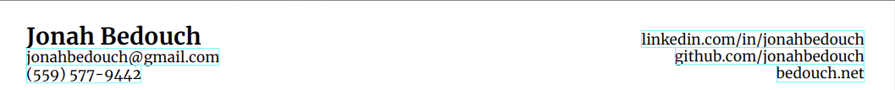
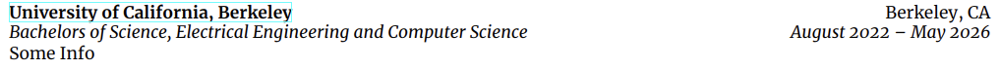
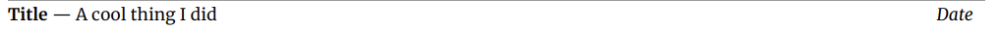

## Jonah Bedouch's Resume

This is yet another (Xe)LaTeX template for a resume, since I, like many, was unsatisfied with the existing options and kind of just wanted the old resume I used to have in a Google Doc in LaTeX.

### A note

This is my first time working with `.sty` files in LaTeX, so I may have done some things that don't work generically that only work on my system. It's hard to be sure, since I have 1 computer (running Manjaro) to test on. The `resume.sty` file assumes that you have the Merriweather font set installed, which you can [download for free from Google Fonts](https://fonts.google.com/specimen/Merriweather). If you think this template is cool, but have any changes that you think are a good idea to make, feel free to submit a PR!

### How to use

Simply ensure you have Merriweather installed, download the `resume.sty` file, include it in a folder with a `.tex` file, and preface your document with:

```tex
% !TeX program = xelatex
\documentclass[10pt]{article}
\usepackage{resume}
```

If working in VSCode, it might be necessary to [enable Magic Comments](https://github.com/James-Yu/LaTeX-Workshop/issues/3027) in order for the LaTeX Workshop extension to recognize that xelatex must be used.

### Philosophy

A lot of resume templates are super hands on, giving you typed sections, specific items within each section type, and so on. I'm pretty particular about my header, so that is fixed (I couldn't find a satisfying way to generalize it, if you can, again, submit a PR please!), but the rest of the document is dictated by 3 generally loose macros that allow for a wide amount of customization.

## How does it work?

The template introduces three key macros alongside document styling and a custom title:

- The `section` environment (overriding the default article environment)
- The `sectionitem` environment
- The `inlineitem` command

Note that the environments in this project likely could be commands, however they are designed as environments to allow clean grouping within the main tex file.

### The header

Before discussing the environments, I thought it'd be useful to showcase how the header works. The header is implemented as an override of `\maketitle`. Before running `\maketitle`, the following definitions allow for content to be added to the header:
| Syntax | Action |
| ------- | ------ |
| `\name{name}` | Adds your name to the resume (only required field) |
| `\email{email}` | Adds an email below your name, with `mailto:` link. |
| `\phone{pretty number}{number}` | Adds a phone number below your name, with `tel:number` link. |
| `\website{display}{link}` | Adds a link to the right side with message `display` and url `link` |

Optionally, if you intend to present a LinkedIn or GitHub, the following aliases exist (Note that these are purely for convenience, and any website including these can be added using `\website`):
| Syntax | Action |
| ------- | ------ |
| `\linkedin{username}` | Adds your linkedin to the right side |
| `\github{username}` | Adds your GitHub to the right side |

This setup allows for you to make progressively more complex headers, with the most basic example being a name:

```tex
\name{Jonah Bedouch}

\maketitle
```


And the most complex a name, phone number, email, and three links on the right hand side:

```tex
\name{Jonah Bedouch}
\email{jonahbedouch@gmail.com}
\phone{(559) 577\nobreakdash-9442}{+15595779442}
\linkedin{jonahbedouch}
\github{jonahbedouch}
\website{bedouch.net}{https://bedouch.net}

\maketitle
```



Note that the order of the links on the right hand side is determined by the order in which `\website` or an alias is called in the main document. Any calls to `\website` or an alias beyond the initial three will do nothing.

### The section environment

This environment adds the top-level header and spacing to a document. It takes in one argument, the title of the header. An example of its use is as follows:

```tex
\begin{section}{Education}
    Some Content here
\end{section}
```


### The sectionitem environment

This environment allows for the creation of heading and spacing for a specific entry in any section. The syntax for its use is:

```tex
\begin{sectionitem}[Title={}, TitleLink={}, Subtitle={}, City={}, Date={}]
```

Note that all fields are optional except for the title field, allowing for differing levels of headers. The only situation that results in potentially unexpected behavior is when the Title **and** Subtitle are declared, and only one of the City or Date is declared. In this case, due to either the City or the Date being allowed on the top line, the declared value will be duplicated across both lines. I might look into alternate ways to resolve this later, but it doesn't currently pose an issue for me.

The most basic header looks as follows:

```tex
\begin{sectionitem}[Title={University of California, Berkeley}]
    Some Info
\end{sectionitem}
```


This can be made more advanced with the addition of any number of other options:

```tex
\begin{sectionitem}[
    Title={University of California, Berkeley},
    TitleLink={https://berkeley.edu},
    Subtitle={Bachelors of Science, Electrical Engineering and Computer Science},
    City={Berkeley, CA},
    Date={August 2022 -- May 2026}
    ]
        Some Info
\end{sectionitem}
```



Honestly, this may not be as bug tested as it probably should be, so if you find any issues feel free to open an issue.

### Inline Item Command

When working with bulleted lists, sometimes it's helpful to be able to have an abridged heading inline. `\inlineitem` accomplishes this with the following syntax:

```tex
\inlineitem[right message]{title}{deliniator}{description}
```

Although the right message property is the only optional property, all four of the properties can be left blank to achieve an optional effect. This command formats messages as follows:

```tex
\inlineitem[Date]{Title}{ --- }{A cool thing I did}
```



Combining these three tools together along with native LaTeX (such as the `itemize` context) allows for the creation of pretty complex resumes in an easy to follow `.tex` file. An example of this can actually be seen in the form of my real, up-to-date resume, which is what `resume.tex` and `resume.pdf` are.
